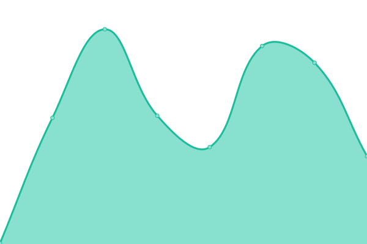

# [📈 Live Status](https://demo.upptime.js.org): <!--live status--> **🟧 Partial outage**

This repository contains the open-source uptime monitor and status page for [Lokman](https://lokman.fr/), powered by [Upptime](https://github.com/upptime/upptime).

With [Upptime](https://upptime.js.org), you can get your own unlimited and free uptime monitor and status page, powered entirely by a GitHub repository. We use [Issues](https://github.com/loke-60000/upptime/issues) as incident reports, [Actions](https://github.com/loke-60000/upptime/actions) as uptime monitors, and [Pages](https://demo.upptime.js.org) for the status page.

<!--start: status pages-->
<!-- This summary is generated by Upptime (https://github.com/upptime/upptime) -->
<!-- Do not edit this manually, your changes will be overwritten -->
<!-- prettier-ignore -->
| URL | Status | History | Response Time | Uptime |
| --- | ------ | ------- | ------------- | ------ |
|  [lokman.fr](https://lokman.fr) | 🟩 Up | [lokman-fr.yml](https://github.com/Loke-60000/upptime/commits/HEAD/history/lokman-fr.yml) | 

 187ms
     
 | 

<a href="https://loke-60000.github.io/upptime/history/lokman-fr">100.00%</a>
    

|  [gadget-lab.fr](https://gadget-lab.fr) | 🟩 Up | [gadget-lab-fr.yml](https://github.com/Loke-60000/upptime/commits/HEAD/history/gadget-lab-fr.yml) | 

 351ms
     
 | 

<a href="https://loke-60000.github.io/upptime/history/gadget-lab-fr">98.83%</a>
    

|  [gadget-lab.net](https://gadget-lab.net) | 🟥 Down | [gadget-lab-net.yml](https://github.com/Loke-60000/upptime/commits/HEAD/history/gadget-lab-net.yml) | 

 0ms
     
 | 

<a href="https://loke-60000.github.io/upptime/history/gadget-lab-net">0.00%</a>
    

|  [Amadeus-gpt](https://viktorchondria.com/) | 🟩 Up | [amadeus-gpt.yml](https://github.com/Loke-60000/upptime/commits/HEAD/history/amadeus-gpt.yml) | 

 221ms
     
 | 

<a href="https://loke-60000.github.io/upptime/history/amadeus-gpt">100.00%</a>
    

|  [Searx](https://search.gadget-lab.net) | 🟩 Up | [searx.yml](https://github.com/Loke-60000/upptime/commits/HEAD/history/searx.yml) | 

 518ms
     
 | 

<a href="https://loke-60000.github.io/upptime/history/searx">100.00%</a>
    

|  [Jin-Joo](https://www.jin-joo.fr/) | 🟩 Up | [jin-joo.yml](https://github.com/Loke-60000/upptime/commits/HEAD/history/jin-joo.yml) | 

 569ms
     
 | 

<a href="https://loke-60000.github.io/upptime/history/jin-joo">100.00%</a>
    

|  [Hacker News](https://news.ycombinator.com) | 🟩 Up | [hacker-news.yml](https://github.com/Loke-60000/upptime/commits/HEAD/history/hacker-news.yml) | 

 341ms
     
 | 

<a href="https://loke-60000.github.io/upptime/history/hacker-news">100.00%</a>
    

|  [IPv6 test](forwardemail.net) | 🟥 Down | [i-pv6-test.yml](https://github.com/Loke-60000/upptime/commits/HEAD/history/i-pv6-test.yml) | 

 0ms
     
 | 

<a href="https://loke-60000.github.io/upptime/history/i-pv6-test">100.00%</a>
    

<!--end: status pages-->

[**Visit our status website →**](https://demo.upptime.js.org)

## 📄 License

- Powered by: [Upptime](https://github.com/upptime/upptime)
- Code: [MIT](./LICENSE) © [Anand Chowdhary](https://anandchowdhary.com), supported by [Pabio](https://pabio.com)
- Data in the `./history` directory: [Open Database License](https://opendatacommons.org/licenses/odbl/1-0/)
